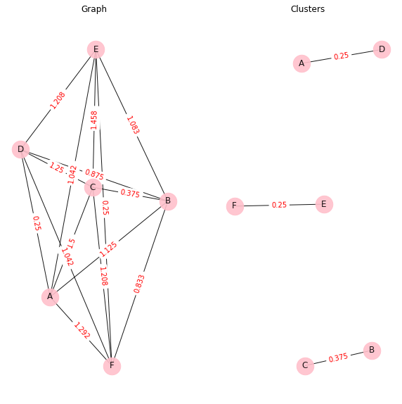
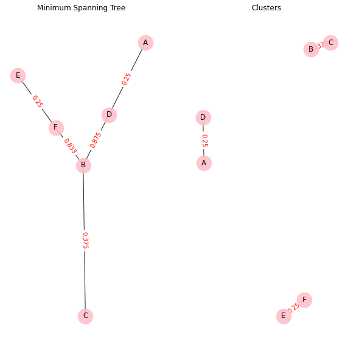

### CGraph clustering algorithm
#### Graph based clustering algorithm. The algorithm itself determines the number of clusters. Returns clusters linked in an array. 
##### Arguments:
###### df - DataFrame
###### metric - Metric for finding distance (manhattan, euclid, max). Default - euclid.
###### r - R coefficient is involved in clustering and has a big impact on the result. Default - std.
###### rnd - Round (numbers after the decimal point). Default 3.
###### draw - Draw graph. Default - False.
###### info - Print info. Default - True.
```python
import pandas as pd
from neulab.Clustering import CGraph
d = {'Age': [18, 33, 42, 24, 19, 25], 'Sex': [0, 1, 1, 0, 2, 2]}
df = pd.DataFrame(data=d, index=['A', 'B', 'C', 'D', 'E', 'F'])

clusters = CGraph(df, metric='manhattan', r='std', rnd=3, draw=False, info=True)

Output:
Distances: {'A|B': 1.125, 'A|C': 1.5, 'A|D': 0.25, 'A|E': 1.042, 'A|F': 1.292, 'B|C': 0.375, 'B|D': 0.875, 'B|E': 1.083, 'B|F': 0.833, 'C|B': 0.375, 'C|D': 1.25, 'C|E': 1.458, 'C|F': 1.208, 'D|B': 0.875, 'D|C': 1.25, 'D|E': 1.208, 'D|F': 1.042, 'E|B': 1.083, 'E|C': 1.458, 'E|D': 1.208, 'E|F': 0.25}
R = 0.388
Found clusters: [['D', 'A'], ['C', 'B'], ['E', 'F']]
```


### CGraphMST clustering algorithm
#### Graph based clustering algorithm.The user himself sets the number of clusters. Returns clusters linked in an array. 
##### Arguments:
###### df - DataFrame
###### clst_num - number of clusters.
###### metric - Metric for finding distance (manhattan, euclid, max). Default - euclid.
###### rnd - Round (numbers after the decimal point). Default 3.
###### draw - Draw graph. Default - False.
###### info - Print info. Default - True.
```python
import pandas as pd
from neulab.Clustering import CGraphMST

d = {'Age': [18, 33, 42, 24, 19, 25], 'Sex': [0, 1, 1, 0, 2, 2]}
df = pd.DataFrame(data=d, index=['A', 'B', 'C', 'D', 'E', 'F'])

clusters = CGraphMST(df, clst_num=3, metric='manhattan', rnd=3, draw=True, info=True)
```
